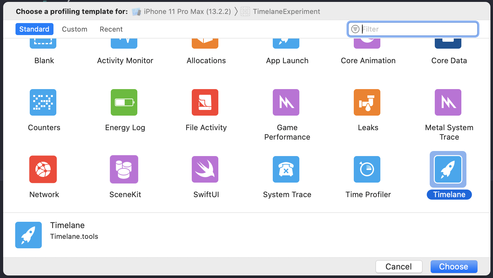
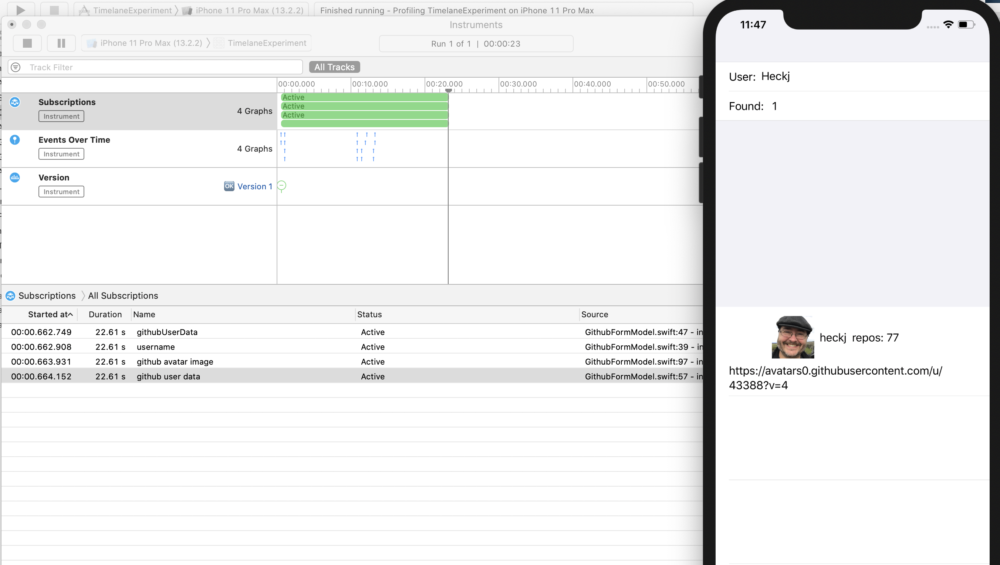
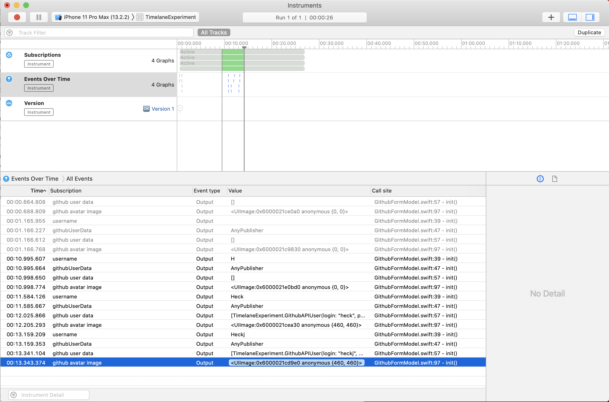

# TimelaneExperiment

SwiftUI experiment using TimeLane - a tool by Marin Todorov for capturing and logging Combine events using Xcode Instruments.

In order to see the profiling, you will need to install TimeLane in addition to using this repository:

* download from http://timelane.tools
* run application and click on the package icon to install the instrument locally
* Choose Product -> Profile in Xcode to build and invoke Instruments

The project itself is a simple SwiftUI form that has two combine pipelines:

1. triggers based on user input of a username and retrieves general github User data from the Github API.
2. triggers based on the github API response and retrieves the avatar URL into a UIImage instance.

Running and capturing the profile data:

The resulting data looks like:

